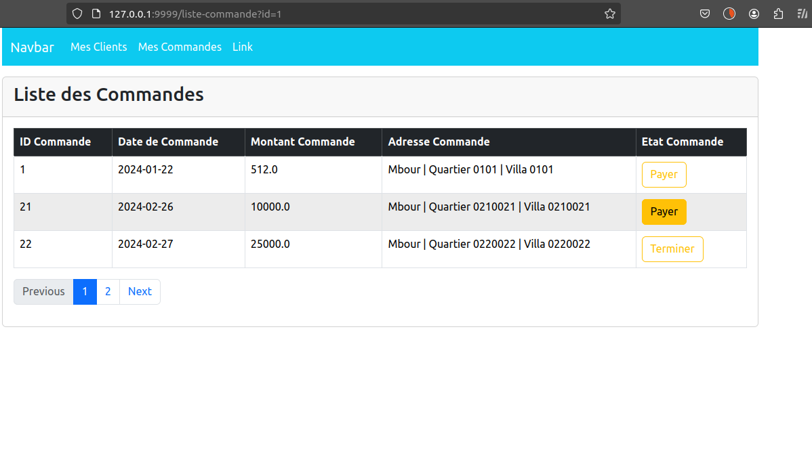

#### Diagramme de classe


#### Categorie


#### Article


#### Client


#### Commande


#### Ligne de commande


#### Liste des clients


#### Commande d'un client avec pagination quand on clique sur le bouton au niveau de la page client


Quelque avantage d'utiliser dto : 
- balancer a la view que les données dont il a besoin et non l'entité directement
- Question de securité t'as capté : quand on balance l'entité et qu'il ya des relations etc , on pourra acceder au differents entité qui sont en relation or avec dto , on limite cela

```java
//Builder pour generer des méthodes de création d'instances de manière fluide et concis
//Rendre dynamique le bouton etat commande
/*quand une commande est encours btn devient => Payer
quand une commande est   Facturer    => Payer
                         Facturer    => Terminer
                         Payer    => Payer
 */


    public static CommandeShowEntityResponseDto toDto(Commande commande){
            //rendre etat suivant dynamique dans la view
            EtatCommande EtatSuivant = EtatCommande.Payer;
            if(commande.getEtat() != EtatCommande.Payer){
                long indexEnumEtat = commande.getEtat().getIndexEnumEtat()+1;
                EtatSuivant = EtatCommande.values()[Long.valueOf(indexEnumEtat).intValue()];
    
            }
            return CommandeShowEntityResponseDto
                    .builder()
                    .id(commande.getId())
                    .dateCommand(commande.getDateCommand())
                    .montant(commande.getMontant())
                    .etat(commande.getEtat())
                    .etatSuivant(EtatSuivant)
                    .adresse(commande.getAdresse())
                    .build();
        }
```

#### Formulaire d'ajout de client


<br/>


#### Ajouter une nouvelle commande


#### Formulaire ajout d'une nouvelle commande + affichage des infos du client dans le formulaire
